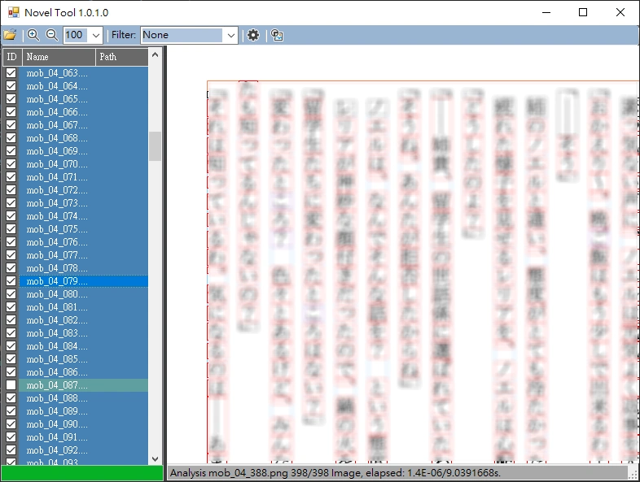
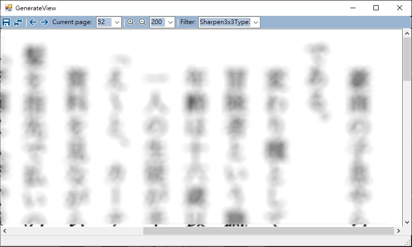

# NovelTool

NovelTool is a tool written in .Net Framework 4.8 for reformatting novel/eBook images into pictures of specified output resolution.

## Table of Contents

- [NovelTool](#noveltool)
  * [Building](#building)
  * [Getting started](#getting-started)
  * [Analysis Novel](#analysis-novel)
  * [Generate View](#generate-view)
  * [Option settings](#option-settings)
    + [Analysis](#analysis)
    + [Rect View](#rect-view)
    + [Generate](#generate)

[TOC generated by markdown-toc](https://ecotrust-canada.github.io/markdown-toc/)

## Building

- Open `NovelTool.sln` with Visual Studio([Community](https://visualstudio.microsoft.com/vs/community/) also available) and built with .Net Framework 4.8.

## Getting started

1. Open the folder or zip of novel/eBook file, analyze image content immediately.
2. Wait for the analysis of the novel/eBook results to be completed.
3. Maybe you need to change the option settings, when the analysis result is wrong. Re-analyze the novel/eBook file after changing settings.
4. Now execute GenerateView from the toolbar to confirm the generated content.
5. The size of the output text image can be changed.
6. Save the generated content as a new image file.

  
  

## Analysis Novel

- Parse the novel/eBook image file sequentially from the vertical direction and detect the position of the text.

## Generate View

- Reformat the recognized text image according to the specified output resolution, and generate a new image file.

## Option settings

### Analysis

1. AnalysisFactor
   * `AnalysisTaskThreadLimit`: Determines the maximum number of threads to perform analysis tasks (Default 2).  
   * `IgnoreMinDetectXSize`: Decided to ignore left and right widths when detecting images (Default 3, if there is non-text content on the edge).  
   * `IgnoreMinDetectYSize`: Decided to ignore top and bottom widths when detecting images (Default 3, if there is non-text content on the edge).  
   * `IllustrationMinHeight`: XXXX  
   * `IllustrationMinWidth`: XXXX  

1. Rate
   * `HeadMinRate`: Determines the scale value of the header on the page from top to bottom (Default 0.1, Max 1).  
   * `FooterMinRate`: Determines the scale value of the footer on the page from top to bottom (Default 0.95, Max 1).  
   * `IllustrationRate`: XXXX  
   * `EntityMinRate`: Determines the scale value of the smallest text (rubi characters/ルビ) when the standard text scale is 1 (Default 0.6).  
   * `EntityMaxRate`: Determines the scale value of the largest text (parsable as standard text) when the standard text scale is 1 (Default 1.2).  
   * `EntityAdjacentRate`: Determines the minimum scale value that is immediately adjacent between two lines (Default 0.2, for example standard text and rubi characters).  
   * `EntityMergeTBMaxRate`: Determines the scale value that can be merged into a one character, when a character is broken by wrong analysis (Default 1, for example 元, 二, 言...).  

1. Confirm
   * `IllustrationMinColorsLevel`: Determine the minimum number of colors for illustrations that can be detected as non-text (Default 2000, duplicate colors are not counted).  
   * `IllustrationMinNonWhiteLevel`: Determine the minimum number of foreground colors for illustrations that can be detected as non-text (Default 800000).  
   * `WhiteLevel`: Determines the color value detected as the background(white) color (Default 240).  
   * `HeadGap`: Determines the minimum height  of the top margin above the header (Default 15).  
   * `FooterGap`: Determines the minimum height of the bottom margin below the footer (Default 15).  
   * `EntityHeadGap`: This value is related to determining whether it is the first word of the line (Default 0).  
   * `EntityEndGap`: This value is related to determining whether it is the end of the line (Default 0).  

### Rect View

1. RectView
   * `RectViewWidth`: Determines the rendered Rect line width (Default 1).  

1. RectColor
   * `RectHeadColor`: Determines the rendered header Rect line color (Default DarkMagenta).  
   * `RectBodyColor`: Determines the rendered body Rect line color (Default Coral).  
   * `RectFooterColor`: Determines the rendered footer Rect line color (Default LightSkyBlue).  
   * `RectColumnColor`: Determines the rendered column Rect line color (Default LightSkyBlue).  
   * `RectEntityBodyColor`: Determines the rendered entity body Rect line color (Default Red).  
   * `RectColumnRubyColor`: Determines the rendered column ruby Rect line color (Default MediumSpringGreen).  
   * `RectRubyColor`: Determines the rendered ruby Rect line color (Default DarkGreen).  
   * `RectMergeTBColor`: Determines the rendered mergeTB Rect line color (Default MediumOrchid).  
   * `RectMergeLRColor`: Determines the rendered mergeLR Rect line color (Default Tomato).  
   * `RectSplitTopColor`: Determines the rendered split top Rect line color (Default Gold).  
   * `RectSplitMiddleColor`: Determines the rendered split middle Rect line color (Default RoyalBlue).  
   * `RectSplitBottomColor`: Determines the rendered split bottom Rect line color (Default LightCoral).  

### Generate

1. Output
   * `OutputWidth`: Determine the output width (Default 1200).  
   * `OutputHeight`: Determine the output height (Default 1600).  
   * `OutputAdjustColorCheck`: Determine whether to use `ForeColorRate` to adjust the contrast color when generating (Default false).  
   * `ForeColorRate`: This value adjusts the contrast color when `OutputAdjustColorCheck` is enabled (Default 0.5, the range is 0~2).  
   * `OutputBackColor`: Determines the output background color (Default White).  
   * `OutputForeColor`: Determines the output foreground color (Default Black).  
   * `OutputImageType`: Determine the output image type (Default Jpeg)(Jpeg, Png, Tiff, Bmp, Gif).  
   * `OutputPixelFormat`: Determine the output Pixel format (Default DontCare)(DontCare, Indexed, Gdi, Alpha, PAlpha, Extended, Canonical, Format1bppIndexed, Format4bppIndexed, Format8bppIndexed, Format16bppGrayScale, Format16bppRgb555, Format16bppRgb565, Format16bppArgb1555, Format24bppRgb, Format32bppRgb, Format32bppArgb, Format32bppPArgb, Format48bppRgb, Format64bppArgb, Format64bppPArgb, Max).  
   * `OutputQuality`: Determine the output image quality, A quality level of 0 corresponds to the greatest compression, and a quality level of 100 corresponds to the least compression (Default 90).  
   * `PagePositionType`: Determine the page number position of the output image (Default None)(None, TopLeft, TopRight, BottomLeft, BottomRight).  

1. Body
   * `MarginLeft`: Determines the left margin width of the output image (Default 30).  
   * `MarginRight`: Determines the width of the right margin of the output image (Default 30).  
   * `MarginTop`: Determines the width of the top margin of the output image (Default 30).  
   * `MarginBottom`: Determines the bottom margin width of the output image (Default 30).  
   * `Leading`: Determine the output image line spacing width (Default 30).  

1. Head & Footer
   * `PositionType`: Determine the header/footer position of the output image (Default None)(None, TopLeft, TopRight, BottomLeft, BottomRight).  
   